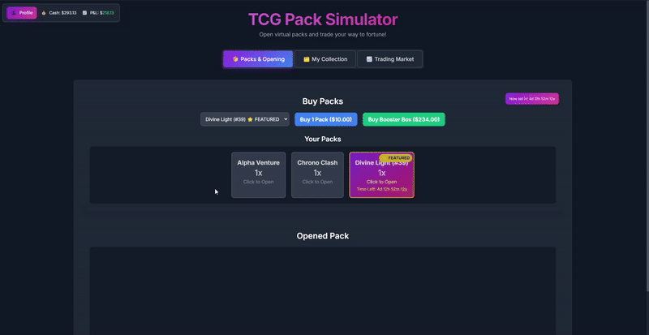

# TCG Pack Simulator

An immersive Trading Card Game pack opening simulator with dynamic market economics. Experience the thrill of opening packs while managing your collection as a trading portfolio.

## Screenshots

<!-- Replace these placeholder paths with actual screenshots/GIFs -->
<div align="center">
  
  
  
</div>

<div align="center">
  <em>Interactive pack opening • Collection tracking • Dynamic market system</em>
</div>

## What It Does

**CardpackSim** simulates the complete TCG experience from pack opening to market trading:

- 💰 **Dynamic Market System** - Buy packs with virtual currency and sell cards at fluctuating market prices  
- 📈 **Economic Strategy** - Manage your wallet, track card values, and maximize profits from your collection
- 🗓️ **Weekly Sets** - Limited-time premium sets with higher value cards and market demand
- 📊 **Collection Tracking** - Monitor your inventory, collection progress, and portfolio value
- 🏆 **Achievement System** - Earn rewards and unlock new content as you play

Perfect for TCG enthusiasts who want to experience the excitement of pack opening and collection building without the real-world cost.

## Quick Start

### Prerequisites
- Node.js (v16 or higher)
- npm

### Installation & Running
```bash
# Install dependencies
npm install

# Run the application
npm start

# Development mode with DevTools
npm run dev
```

### Building Executables
```bash
npm run build          # Current platform
npm run build-win      # Windows
npm run build-mac      # macOS  
npm run build-linux    # Linux
```
Built executables will be in the `dist/` folder.

## Technology Stack

**Built with Electron** - Cross-platform desktop application
- **Frontend**: HTML5, CSS3, JavaScript (ES6+)
- **Backend**: Node.js with local storage persistence
- **Architecture**: Modular design with separated game logic, UI, and market systems

## License

MIT